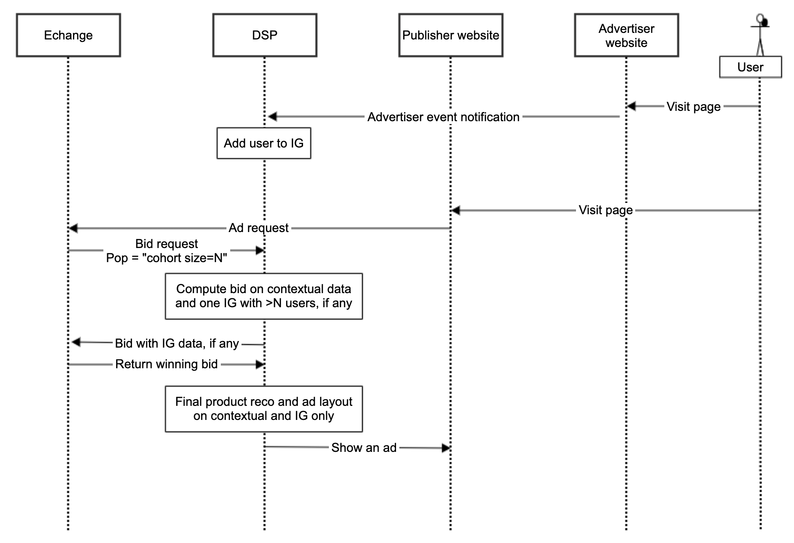

# TEETAR: Testing Environment Enabling Truthful and Actionable Results 
(or: *Testing Cohorts in a Live Environment*)

Photo Credit: Rakesh Kumar Dogra - Licensed under Creative Commons https://commons.wikimedia.org/wiki/File:Grey_Francolin.jpg

## Introduction
This document introduces a set of objectives and a protocol to begin assessing the impact of the TURTLEDOVE and related proposals on the ad-funded open web ecosystem through live tests.

The "objectives" section describes the goals of the test, and which metrics should be used to measure them.

The "test protocol" section describes first a "module by module" breakdown of TTDV and related proposals -we propose testing one module at a time, starting with the "cohorts" module-, the parameters of the tests, and a technical setup for performing this first test.

## Objectives

### Goals

- Evaluate cohorts' impacts on the ecosystem welfare, defined as the value exchanged through advertising.
- Evaluate users' perception of cohort-based advertising.
- Gather data to steer the discussions around TURTLEDOVE and related proposals parameters (e.g. cohort sizes).

### Metrics

We propose **CPM for ad placements sold through a cohort mechanism** to be the key metric for measuring the ecosystem welfare. It's a direct proxy for publishers' revenue and advertiser spend.

We propose to use a **Net Promoter Score** metric for measuring the users' perception of cohort-based advertising. 

## Test protocol

### Module by module 

We propose the following module breakdown of TURTLEDOVE and related proposals. Note that this is by no means an exhaustive list of proposed birds and variants.

Module | Description
-------|------------
Cohorts	| <ul><li>Users join Interest Groups based on DSP signals.</li><li>Those IG replace users cookie ids for bidding, product recommendation, and ads layout.</li></ul>
Bidding service location	| <ul><li>IG bid valuation by DSP occurs either on-device (TTDV), on a neutral third-party (SPARROW, DOVEKEY), or through probabilistic means (Augury).</li></ul>
Ad generation service location | <ul><li>Product recommendation and ad layout generation occur either on-device (TTDV and Product-Level TTDV) or on a neutral third-party (SPARROW).</li></ul>
Reporting, Attribution and Machine Learning |	<ul><li>Reporting data is provided through the Aggregated Reporting API and the Conversion Measurement API, or through enhanced mechanisms (PELICAN, SPURFOWL), or through SPARROW reporting.</li><li>Machine Learning is supported through on-device mechanisms (COWBIRD), or multiple parties (SCAUP).</li></ul> 

Each module has been the subject of several proposals and generally has several parameters to be defined (e.g. cohort size, the noise level in reporting, js function bidding size, etc.). In order to be able to assess each proposal and each parameter fairly, we suggest adding modules one by one as a testing strategy.

We consider the "cohorts" module as the foundation of TTDV, while other modules only ensure that users in cohorts cannot be de-anonymized, or that websites they visit cannot learn the cohorts they belong to. Therefore we propose to start testing with the "cohorts" module. 

### "Cohorts" module test parameters
During the "cohorts" module test, we propose to first evaluate the metrics defined above on a variety of values for the cohorts' minimal size. 

Once a baseline has been established for the "plain vanilla" cohorts mechanism, further testing could be done on suggested enhancements like:

- The ability to combine cohorts data, for supporting use cases other than retargeting (as suggested in [Interet groups audience new building blocks](https://github.com/WICG/sparrow/blob/master/Interest_groups_audiences_new_building_blocks.md)).
- The ability to include user-level signals in bidding (as suggested in [Outcome-based TURTLEDOVE](https://github.com/WICG/turtledove/blob/master/OUTCOME_BASED.md)). 
- Etc.

When analyzing the results of the test, interesting projection dimensions would be:

- The "size" of the publisher, defined in monthly unique visitors
- The "size" of the advertiser, defined in monthly unique visitors

### The technical setup for "cohorts" module testing

#### Fair participation
We believe that all test participants have a clear incentive to emulate as fairly as possible the cohort environment of the Privacy Sandbox. 

Thus, it is taken as granted in the rest of this document that participants (DSPs and others) won't take advantage of the test's lack of enforcement of privacy rules (knowing that they will be indeed enforced in the future implementation of the Privacy Sandbox) for the duration of the test.

#### Required properties

The test protocol should have the following properties:

- Cohorts are defined and managed by the DSP:
  - Each DSP can assign users in Interest Groups.
  - Interest Groups are "active" only once their number of users reaches a certain threshold (parameter of the test).
  - When switching to a "cohorts" mode, the DSP shall not use any user-level data for bidding, product recommendation, and ad serving.

- Whenever Interest Groups are used in auctions:
  - For the test to be representative, it would be good to have multiple DSPs placing Interest Group bids. We should therefore encourage multiple DSP to join the test.
  - There can be multiple DSPs placing contextual-only bids.
  - There should not be any competing bid based on user-level identifiers.

- Test populations should be stable through time.  
- Test metrics values can be compared with similar web traffic using 3rd party cookies. 
- In addition, several cohort sizes can be tested in parallel (in different test populations).

All other advertising process steps (bidding service location, ad generation location, and reporting) should remain unchanged.

#### Technical setup
We propose the following technical setup:

- One large Exchange would be responsible to define a users population split
- Several DSPs would participate in the test
- Each DSP would manage their users' Interest Groups internally

- For a test population "size=X cohorts"
  - DSPs should put each user in one or more Interest Groups according to the user buying intents
  - An Interest Group can be used for bidding and ad selection only when X users or more belong to it

This translates into:

1. The Exchange splits the users into several distinct random populations:
   1. A reference population
   2. A "size=N cohorts" population
   3. A "size=M cohorts" population
   4. etc.
2. When a test user visits an advertiser website, the DSP collecting advertiser events can internally add this user to one or more pre-defined Interest Groups.
   1. A user population can be learned through bid request signals (see below).
3. At bid request time, for test users, the Exchange sends the same signal "cohorts size=X", alongside the user id (3rd party cookie id).
4. Each participating DSP shall then:
   1. Retrieve the Interest Groups with more than X users this user belongs to.
   2. Compute a bid value based on one of these Interest Group data, if any, alongside with contextual data, but **without using any user-level data**.
5. Send back the bid value to the Exchange alongside the Interest Group data.
6. The Exchange runs the auction and selects the winning bid.
7. The winning DSP generates an ad (product recommendation and layout), **without using any user-level data**. 

Reporting and attribution are still based on user-level data. 

 
#### Additional considerations

- Although each DSP sees the full list of Interest Groups a user belongs to, each Interest Group should be used independently of the others for bidding, product recommendation, and ad layout computation.
- DSPs not participating in the test shall not send user-level bids for users in test populations. We recommend in that case that the Exchange sends 'contextual' bid requests (without usual user id field) to these DSPs.
- The Exchange shall encourage as much as possible multiples DSPs to send interest-based bids for a large majority of the auctions on test users. 
  - Indeed, if there is only one or a couple of Interest Group bids in these auctions, there will be no competition, and models will automatically learn to reduce the bid value.
  - That would not be a fair representation of the target state, where all DSPs have switched to an Interest Group bidding mode. 
  - To assess whether the test was indeed a fair representation of the target state, the Exchange should report on the level of competition in auctions for each DSP. 
- The above mechanism should be adjusted when the auction includes several steps (e.g. header bidding).
- Interest group data is sent in the bid response to the Exchange for analytics purposes.

### User engagement

For users in test or reference populations, on the ads sold through the Exchange by participating DSPs, we propose to measure user engagement by:

- Running random in-ad surveys, e.g. "what's your feeling about this ad? positive, neutral, negative.", and computing a Net Promoter Score
- Comparing the rate of "close this ad" actions, and the answers given to "why close this ad?".

Note that users in the test populations will only be exposed to contextual or Interest Group-based ads from participating DSPs, but they will still get plenty of targeted ads from non-participating DSPs or from environments with high personalization. Nevertheless, this will still be true once the Privacy Sandbox is fully operational.

## Contacts

- Arnaud Blanchard a.blanchard@criteo.com
- Paul Marcilhacy p.marcilhacy@criteo.com
- Basile Leparmentier b.leparmentier@criteo.com
- Lionel Basdevant l.basdevant@criteo.com 
